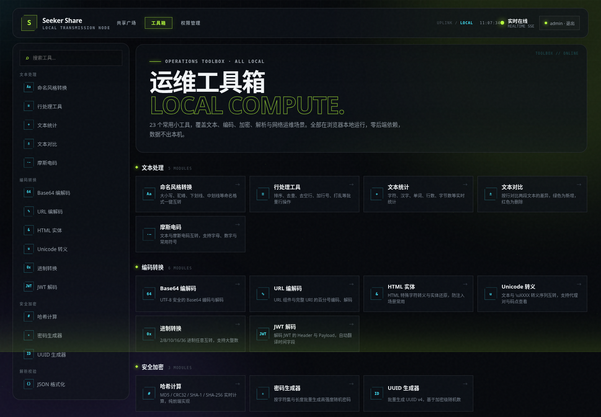

# Seeker Share

> 一个轻量、炫酷、基于 H2 的局域网消息与文件共享节点，内置 26 个纯前端运维小工具。

Seeker Share 用于在同一局域网内快速传递文字、链接、代码片段和文件。项目采用单机部署，数据不会经过第三方云服务。共享广场需要登录，公开注册关闭；工具箱保持匿名可用。

## 界面预览

### 共享广场


### 运维工具箱



### 用户与权限管理


## 核心能力

### 共享广场

- 局域网内共享文字、链接和代码片段
- 一键复制消息，支持单条删除与全部清空
- 上传、下载最大 100MB 的文件
- 支持文件拖拽、多文件队列和实时上传进度
- 通过 SSE 向所有在线设备实时同步共享记录
- 支持关键词搜索以及消息、文件类型筛选
- 自动发现并展示可用的局域网访问地址
- 默认 24 小时自动销毁过期内容
- 默认限制总共享空间为 1GB
- 删除与清空操作分别受独立权限控制
- H2 持久化共享元数据，文件正文保存在本机目录
- 基于用户、角色、权限的 RBAC 鉴权，所有共享 API 均由后端强制校验
- 自动初始化管理员与管理员/成员角色，不开放公开注册
- 初始账户首次登录必须修改密码，包含密码强度检查与登录失败锁定
- 响应式赛博终端界面，适配桌面端和移动端

### 运维工具箱

顶部导航切换到「工具箱」，26 个常用小工具**全部在浏览器本地运行，零后端依赖，数据不出本机**：

| 分类 | 工具 |
| --- | --- |
| 文本处理 | 命名风格转换（camelCase / snake_case / kebab-case 等 9 种）、行处理（排序、去重、打乱等）、文本统计、文本对比（LCS 行级 diff）、摩斯电码、全角/半角转换 |
| 编码转换 | Base64（UTF-8 安全）、URL 编解码、HTML 实体、Unicode 转义、进制转换（BigInt 大数，2~36 进制）、JWT 解码 |
| 安全加密 | 哈希计算（MD5 / SHA-1 / SHA-256 / CRC32，纯 JS 实现，HTTP 环境可用）、密码生成器（熵估算）、UUID v4 |
| 解析校验 | JSON 格式化 / 压缩 / 键名排序、正则测试器（实时高亮、捕获分组、速查表）、Cron 解析器（5/6 位表达式、中文释义、推算未来执行时间）、时间戳转换、URL 解析 |
| 网络运维 | IP 子网计算器（CIDR：网络地址、掩码、广播、可用主机）、HTTP 状态码速查 |
| 学习工具 | 字帖生成器（田字格 / 米字格 / 方格、描红临摹、拼音与笔画标注、打印 / PNG 导出）、汉字注音（带声调 / 数字声调 / 无声调、多音字可选） |
| 实用杂项 | 颜色转换（HEX / RGB / HSL）、Lorem 假文生成 |

工具箱支持哈希路由直达，例如 `#/tools/cron`、`#/tools/regex`，可直接分享或收藏具体工具链接；侧边栏提供分类菜单与关键词搜索。

## AI Coding 声明

本项目包含 **AI Coding**：项目架构、功能实现、界面设计、测试和文档维护均有 AI 参与。AI 的使用方式、工程约定、质量保障流程与贡献记录详见 [docs/AI_CODING.md](docs/AI_CODING.md)。

如果你在使用中遇到 Bug、兼容性问题，或有新的功能建议，请前往 [GitHub Issues](https://github.com/Plan-Coding/seeker_share/issues) 提交反馈。Issue 将通过 AI 辅助分析、修复和完善，并在提交前进行必要的代码检查与测试。

提交 Issue 时建议提供：

- 问题现象和复现步骤
- 使用的操作系统、Java 版本和浏览器
- 相关日志或截图
- 期望的正确行为

## 技术栈

- Java 25
- Spring Boot 4.1.1
- Spring Web MVC
- Spring Security
- Spring Data JPA / Hibernate
- H2 Database
- Thymeleaf
- Jakarta Validation
- Server-Sent Events（SSE）
- Spring Boot Actuator
- 原生 JavaScript / CSS3（工具箱零第三方依赖）
- Maven Wrapper

## 快速开始

项目自带 Maven Wrapper，无需预先安装 Maven：

```bash
git clone https://github.com/Plan-Coding/seeker_share.git
cd seeker_share
./mvnw spring-boot:run
```

启动后访问：

- 首页（共享广场）：<http://localhost:8080/>
- 运维工具箱：<http://localhost:8080/#/tools>
- 用户与权限管理：<http://localhost:8080/#/admin>（仅向具备管理权限的账户显示）
- 共享 API：<http://localhost:8080/api/v1/shares>
- 健康检查：<http://localhost:8080/actuator/health>

首次启动会创建管理员账户：

- 用户名：`admin`
- 初始密码：`ChangeMe!2026`

首次登录后必须立即设置至少 12 位、同时包含大小写字母、数字和特殊字符的密码。生产环境请通过下方环境变量覆盖初始凭据。

同一局域网内的其他设备使用运行主机的 IP 地址访问，例如：

```text
http://192.168.1.10:8080
```

> 请确认操作系统防火墙允许局域网设备访问应用端口。

## 配置

| 环境变量 | 默认值 | 说明 |
| --- | --- | --- |
| `SERVER_PORT` | `8080` | HTTP 服务端口 |
| `SERVER_ADDRESS` | `0.0.0.0` | 服务监听地址 |
| `SHARE_STORAGE` | 系统临时目录 | 上传文件的保存目录 |
| `EXPIRATION_HOURS` | `24` | 内容自动过期时间，单位为小时 |
| `MAX_STORAGE_BYTES` | `1073741824` | 允许使用的最大文件空间，默认 1GB |
| `SEEKER_DB_PATH` | `./data/seeker-share` | H2 数据库文件路径（无需扩展名） |
| `SEEKER_DB_USERNAME` | `sa` | H2 用户名 |
| `SEEKER_DB_PASSWORD` | 空 | H2 密码 |
| `ADMIN_USERNAME` | `admin` | 首次初始化的管理员用户名 |
| `ADMIN_INITIAL_PASSWORD` | `ChangeMe!2026` | 管理员初始密码，仅首次建号使用 |
| `MAX_FAILED_LOGIN_ATTEMPTS` | `5` | 连续登录失败后的锁定阈值 |

推荐的启动方式：

```bash
ADMIN_USERNAME=admin \
ADMIN_INITIAL_PASSWORD='replace-with-a-strong-password' \
SEEKER_DB_PATH=/data/seeker-share/db \
SHARE_STORAGE=/data/seeker-share \
EXPIRATION_HOURS=24 \
MAX_STORAGE_BYTES=1073741824 \
./mvnw spring-boot:run
```

## 构建与测试

```bash
./mvnw test
./mvnw clean package
java -jar target/seeker-share-0.0.1-SNAPSHOT.jar
```

## 目录结构

```text
src/main/java/com/seeker/share/
├── common/       # 通用 API 响应
├── security/     # 用户、角色、权限、认证与安全配置
├── share/        # 分享模型、存储、清理和实时事件服务
└── web/          # 页面与 REST 控制器
src/main/resources/
├── static/
│   ├── css/      # app.css 共享界面 · tools.css 工具箱界面
│   └── js/       # app.js 共享逻辑 · tools.js 工具箱（纯前端）· hanzi-data.js 汉字拼音/笔画数据
└── templates/    # Thymeleaf 页面模板
```

## 数据说明

账户、角色、权限和共享元数据保存在 H2 数据库中，上传文件正文保存在 `SHARE_STORAGE` 指定的目录。迁移或备份时必须同时保留数据库文件与上传目录。

公开注册功能未提供。管理员可通过受 `USER_MANAGE` 权限保护的 `/api/v1/admin/users` 接口创建、停用、解锁账户或重置初始密码；角色及权限管理接口受 `ROLE_MANAGE` 权限保护。

## 免责声明

本软件按“原样”提供，不作任何明示或默示的保证。使用者应自行评估并承担使用本软件所产生的风险。

在适用法律允许的最大范围内，项目作者及贡献者不对因使用或无法使用本软件而产生的任何直接、间接、偶然、特殊或后果性损失承担责任，包括但不限于数据丢失、文件损坏、设备故障、业务中断或利润损失。

完整许可条款请参阅 [MIT License](LICENSE)。如本说明与 LICENSE 文件存在差异，以 LICENSE 文件中的英文条款为准。

## License

本项目基于 [MIT License](LICENSE) 开源。

Copyright (c) 2026 Plan-Coding
